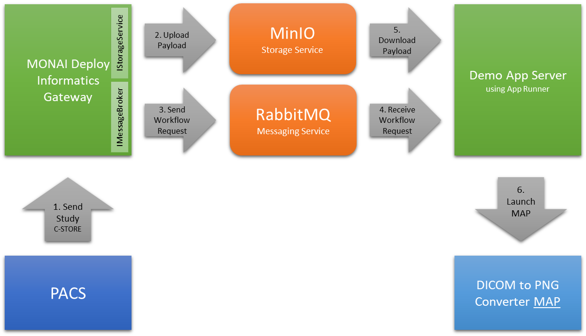

# DEMO: MONAI Deploy App SDK App Runner Integration

This demo shows how an application integrates with the MONAI Deploy Informatics Gateway (MIG) by subscribing to events emitted by MIG and launches the configured MONAI Deploy Application Package (MAP).

## Requirements

- MONAI Deploy Informatics Gateway 0.1.0+
- MONAI Deploy App SDK 0.2.1+ with [dicom_series_to_image_app](https://github.com/Project-MONAI/monai-deploy-app-sdk/tree/main/examples/apps/dicom_series_to_image_app) built as `dcm-to-img:latest`
- RabbitMQ configured and running
- MinIO configured and running
- Python 3.7+

## Running the demo

1. Install requirements specified above
2. Install python dependencies specified in [requirements.txt](./requirements.txt)
3. Edit `config.json` and change:
   1. `endpoint`/`host`, `username`, and `password` for both storage and messaging services
   2. `bucket` where payloads are stored
   3.  `application` to point to the correct MAP
4. python app.py

**Notes**: For MONAI Deploy App SDK 0.2.1, set `ignore_json` to false in the `config.json` file so DICOM JSON files are not downloaded.

## Tips

- Try another MAP by changing `application` in the `config.json` file.
- Instead of calling App Runner, integrate with [MIS](https://github.com/Project-MONAI/monai-deploy-app-server)
