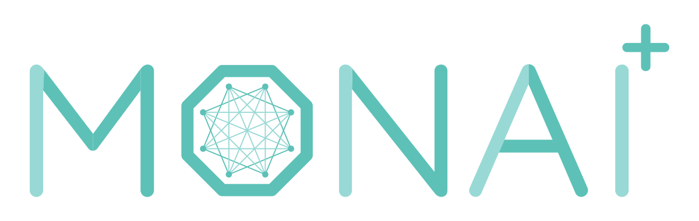

<!--
  ~ Copyright 2021-2023 MONAI Consortium
  ~
  ~ Licensed under the Apache License, Version 2.0 (the "License");
  ~ you may not use this file except in compliance with the License.
  ~ You may obtain a copy of the License at
  ~
  ~ http://www.apache.org/licenses/LICENSE-2.0
  ~
  ~ Unless required by applicable law or agreed to in writing, software
  ~ distributed under the License is distributed on an "AS IS" BASIS,
  ~ WITHOUT WARRANTIES OR CONDITIONS OF ANY KIND, either express or implied.
  ~ See the License for the specific language governing permissions and
  ~ limitations under the License.
-->

# MONAI Deploy Informatics Gateway

## Introduction

MONAI Deploy Informatics Gateway (MIG) handles the first and last step in a clinical data pipeline: the input and output (I/O).

MIG uses standard protocols like DICOM and FHIR. It stores studies and resources from the medical record system as payloads. It then notifies the rest of the MONAI Deploy system, specifically the MONAI Deploy Workflow Manager, that data is ready to be processed.

After inference completes, MIG receives notifications for exporting the results to the proper consumers, usually PACS or viewers for visualization, VNAs for storage, and EHRs (Electronic Healthcare Records).

## Services

MIG contains the following standard protocols for communicating with medical devices:

* **DICOM SCP**: C-ECHO, C-STORE
* **DICOM SCU**: C-STORE
* **HL7 Server**: A HL7 MLLP listener.
* **ACR DSI API**: [The American College of Radiology’s Data Science Institute API](https://www.acrdsi.org/-/media/DSI/Files/ACR-DSI-Model-API.pdf)
* **DICOMweb client**: QIDO-RS, WADO-RS, STOW-RS
* **FHIR client**: GET

> [!Note]
> The ACR DSI API uses the DICOMweb client and FHIR client.

### DICOM SCP

The *DICOM SCP Service* accepts standard DICOM C-ECHO and C-STORE commands, which receive DICOM instances for processing. In addition, the Informatics Gateway groups received DICOM instances by the study or series based on the configuration. Once DICOM instances are grouped, they are assembled into a payload for the [MONAI Deploy Workflow Manager](https://github.com/Project-MONAI/monai-deploy-workflow-manager) to consume.

### DICOM SCU

The *DICOM SCU Service* enables users to export application-generated DICOM results to external DICOM devices. It subscribes to the `md.export.request.monaiscu` events generated by the [MONAI Deploy Workflow Manager](https://github.com/Project-MONAI/monai-deploy-workflow-manager) and then exports the data to user-configured DICOM destination(s).

> [!Note]
> DICOM instances are sent as-is; no codec conversion is done as part of the SCU process. 
> See the [DICOM Interface SCU](./compliance/dicom.md#dimse-services-scu) section for more information.

### DICOMWeb STOW-RS

The *DICOMWeb STOW-RS Service* allows users to trigger a new workflow request by uploading a DICOM dataset. The entire DICOM dataset is assembled into a payload for the [MONAI Deploy Workflow Manager](https://github.com/Project-MONAI/monai-deploy-workflow-manager) to consume.
It provides options to trigger a workflow with or without specifying a workflow ID/name. See the
[DICOMWeb STOW-RS](./api/rest/dicomweb-stow.md) section for more information.

### HL7 MLLP Server

The *HL7 MLLP Server* accepts Health Level 7 messages via the MLLP (Minimal Lower Layer Protocol). The received messages are validated and assembled into a payload for the [MONAI Deploy Workflow Manager](https://github.com/Project-MONAI/monai-deploy-workflow-manager) to consume.

### ACR DSI API

The ACR DSI API allows users to trigger inference requests via RESTful calls, utilizing DICOMweb and FHIR to
retrieve data specified in the request. Upon data retrieval, the Informatics Gateway uploads the data to the
shared storage and generates an `md.workflow.request` event, which notifies the
[MONAI Deploy Workflow Manager](https://github.com/Project-MONAI/monai-deploy-workflow-manager) for processing.

### DICOMweb Export

A DICOMweb export agent can export any user-generated DICOM content to configured DICOM destinations. The agent
subscribes to the `md.export.request.monaidicomweb` events generated by the [MONAI Deploy Workflow Manager](https://github.com/Project-MONAI/monai-deploy-workflow-manager)
and then exports the data to user-configured DICOMweb destination(s).
