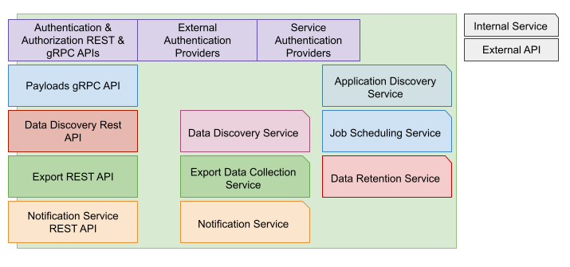
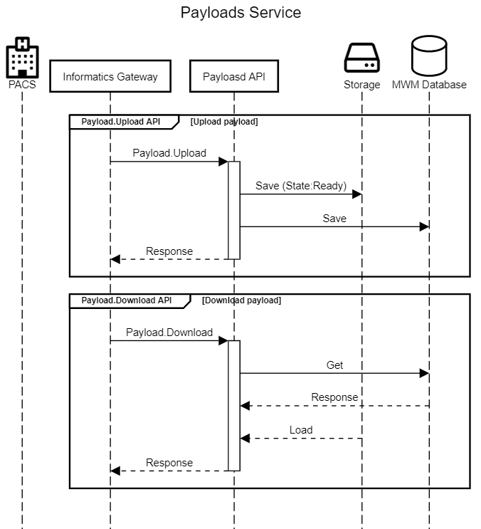
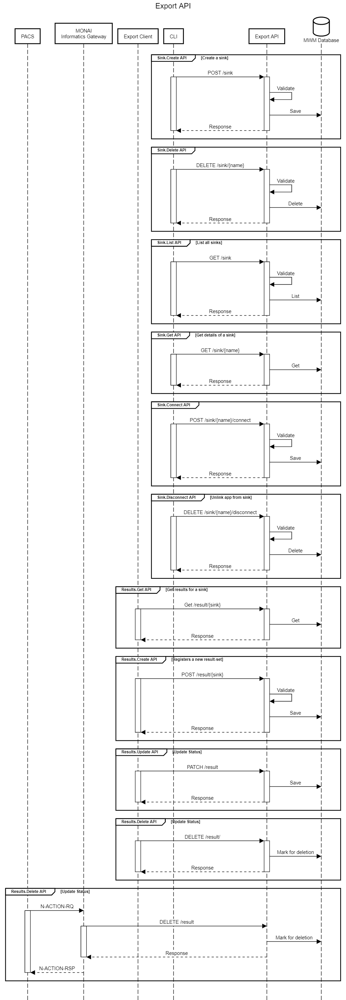
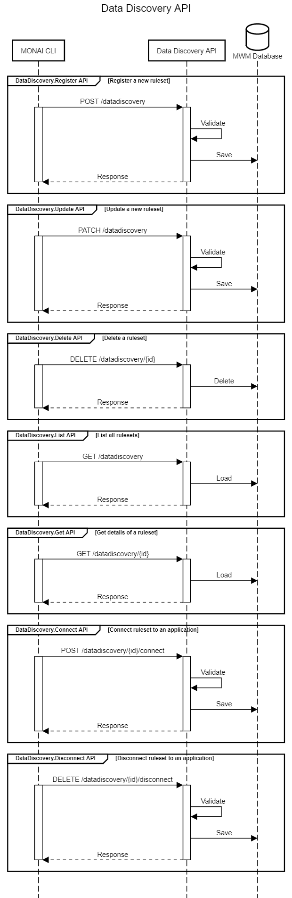
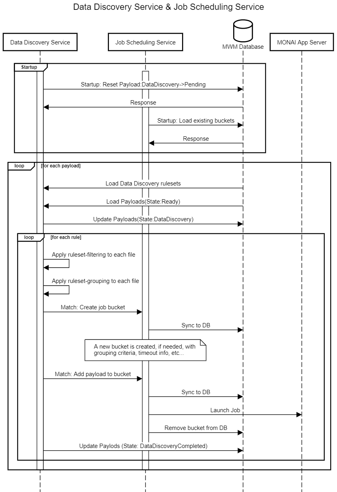
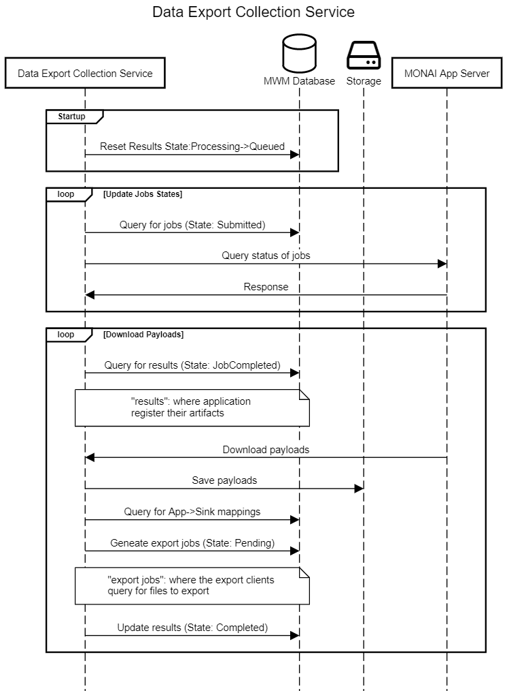

# MONAI Workload Manager Software Architecture & Design


## Overview

The MONAI Workload Manager (MWM) is the central hub for the MONAI Deploy platform for routing data from/to the applications and healthcare information systems (HIS)/radiological information system (RIS).

MWM is responsible for routing data received by the data ingesting services to the data discovery service and associate the data to matching application. It is also responsible for monitoring application execution statuses and route any results produced by the applications back to HIS/RIS.

## Purpose

This document describes the detail designs derived from the requirements defined in MONAI Workload Manager Requirements.

## Scope

The scope of this document is limited to the design of MONAI Workload Manager. This design document does not address any design decisions belonging to other subsystems, such as, MONAI Informatics Gateway, MONAI Deploy Application SDK.

## Assumptions, Constraints, Dependencies

## Definitions, Acronyms, Abbreviations

| Term        | Definition                                                                                                                                                       |
| ----------- | ---------------------------------------------------------------------------------------------------------------------------------------------------------------- |
| Export Sink | An export sink is an user-configured sink where the results (application generated artifacts) are assigned to and later picked up by the export service clients. |
| MWM         | MONAI Workload Manager                                                                                                                                           |
| MIG         | MONAI Informatics Gateway                                                                                                                                        |

## Reference Documents

- [MONAI Workload Manager Requirements](mwm-srs.md)

## Architecture Details

MONAI Workload Manager includes a set of services and APIs to interconnect other sub-systems in MONAI Deploy. Each and every service in the MWM runs on one or more threads which may receive requests from external systems/services. It also interacts with a database and other external services, such as the App Server and/or Argo for job management.

---

### API Surface Area

MWM provides the following APIs:

#### MWM CLI

A CLI (command-line interface) for interacting with the APIs provided.

#### Authentication API

Provides authentication/authorization to connected clients, such as the Informatics Gateway and other export service clients.

#### Payloads API

A set of APIs for uploading/downloading payloads to/from user-deployed applications.

#### Export API

A set of APIs to create export sinks, connect applications to export sinks, and register results.

#### Data Discovery API

APIs to register data discovery rules, connect the rules to applications.

#### Notification Service API

For subscribing/unsubscribing to MWM events.

---

### Internal Services

#### Application Discovery Service

A service that is responsible scanning for MONAI App Server and other supported orchestration engines and make the applications available to other internal services.

#### Job Scheduling Service

A service that dispatches and records job sent to the orchestration engines and monitors job state and status.

#### Notification Service

Notifies subscribed external entities of the system status and jobs' statuses.

#### Data Discovery Service

A service that is responsible for applying user-defined data discovery rules to received datasets. Results of each ruleset is recorded for job scheduling service.

#### Data Export Collection Service

A service that is responsible for retrieving results from orchestration engines and distribute to all configured export sinks.

#### Data Retention Service

Monitors storage usages, apply data retention policies and cleans up storage.

---

### Design



---

#### MWM CLI

The MONAI Workload Manager provides the following CLI tools to configure and connect components in the MONAI Deploy platform:

#### Applications API

- `monai apps list...`

#### Data Discovery Rule

- `monai ddr add...`: add a new data discovery ruleset
- `monai ddr remove...`: delete an existing data discovery ruleset
- `monai ddr update...`: update/replace an existing data discovery ruleset
- `monai ddr list...`: list all installed data discovery ruleset
- `monai ddr connect...`: connect an existing data discovery ruleset to an application
- `monai ddr disconnect...`: disconnect an application from a data discovery ruleset

---

#### Export Sink

- `monai sink add...`: create a new sink for export
- `monai sink remove...`: delete an existing sink
- `monai sink list...`: list all configured sink
- `monai sink connect...`: connect a sink to an application
- `monai sink disconnect...`: disconnect a sink to an application

---

#### Authentication API

_TBD_

---

#### Payloads API



The payloads API allows clients, e.g., the Informatics Gateway, to upload payloads and download payloads.

A payload object contains a single file. Internally, a payload object can represent an **input** payload or an **output** payload. An **input** payload is created when a client uploads data  for processing. An **output** payload is created by the [Data Export Collection Service](#data-export-collection-service).

##### Payload.Upload API

Uploads artifact/file.
Each uploaded payload object must contain:

- Date & time received
- An UUID that can be used to correlate the connection info. E.g., the MONAI Informatics Gateway includes the UUID that is generated when the DICOM association request is received.
- (Optional) The application ID or name to be launched. If specified, the payload bypasses the data discovery service's filtering stage.

##### Payload.Download API

Downloads artifact/file. Used for export service clients.

##### Payload States

- `Ready`: payload is received and stored.
- `DataDiscovery`: payload is being processed by the Data Discovery Service.
- `DataDiscoveryCompleted`: payload has been processed by the Data Discovery Service.

#### Export API



The Export API provides functionalities to create sinks and connect/disconnect sinks to applications. This allows MWM to know how to route application created artifacts/files to one or more user-configured sinks.

In addition, it allows applications using the MONAI App SDK to register any artifacts/files that need to be exported to external devices.


##### POST /sink API

Creates a new sink to be used by an export service.

The `name` of the sink must be unique so it can be referenced by an export service.

###### URL

`/sink`

###### Method

`POST`

###### Data Params

```
{
    "name": "dicom",
    "extensions": [".dcm"],
    "args": {
        "destination": "MySCU"
    }
}
```

#### Success Response

- Code: `201`: Sink created successfully.

  Content: `{"name": "dicom", "extensions": ["dcm"], "args": { "destination": "MySCU" } }`

- Code: `400`: Validation error.

  Content: A [Problem details](https://datatracker.ietf.org/doc/html/rfc7807) object with validation error details.

- Code: `500`: Server error.

  Content: A [Problem details](https://datatracker.ietf.org/doc/html/rfc7807) object with server error details.

##### DELETE /sink/{name} API

Deletes a sink. All connected applications must be removed first.

###### URL

`/sink/{name}`

###### Method

`DELETE`

###### Data Params

N/A

#### Success Response

- Code: `202`: Sink deleted successfully.

  Content: N/A

- Code: `404`: Sink cannot be found.

  Content: N/A

- Code: `500`: Server error.

  Content: A [Problem details](https://datatracker.ietf.org/doc/html/rfc7807) object with server error details.

##### GET /sink API

List all sinks configured on MWM.

###### URL

`/sink`

###### Method

`GET`

###### Data Params

N/A

#### Success Response

- Code: `200`: All sinks returned successfully.

  Content:

  ```json
  ["dicom-xray-room", "fhir-east-us", "appsink"]
  ```

- Code: `500`: Server error.

  Content: A [Problem details](https://datatracker.ietf.org/doc/html/rfc7807) object with server error details.

##### GET /sink/{name} API

Gets details of a sink.

###### URL

`/sink/{name}`

###### Method

`GET`

###### Data Params

N/A

#### Success Response

- Code: `200`: Sink returned successfully.

  Content:

  ```json
  {
    "name": "dicom",
    "extensions": ["dcm"],
    "args": { "aetitle": "PACS1" },
    "apps": ["82582ed7-20a2-4140-9c91-d416267b2cbf"]
  }
  ```

- Code: `404`: Sink cannot be found.

  Content: N/A

- Code: `500`: Server error.

  Content: A [Problem details](https://datatracker.ietf.org/doc/html/rfc7807) object with server error details.

##### POST /sink/{name}/connect API

Connectss an application to the sink.

###### URL

`/sink/{name}/connect`

###### Method

`POST`

###### Data Params

```json
{
  "application": "8ba92f06-215a-474f-a093-d8647f76f561"
}
```

#### Success Response

- Code: `201`: Sink updated successfully.

  Content:

  ```json
  {
    "name": "fhir",
    "extensions": ["json", "xml"],
    "args": { "endpoint": "FHIRSERVER1" },
    "apps": ["b1fc9ab4-428b-44e4-8365-4791fb54d773"]
  }
  ```

- Code: `404`: Sink or application cannot be found.

  Content: A [Problem details](https://datatracker.ietf.org/doc/html/rfc7807) object with error details.

- Code: `500`: Server error.

  Content: A [Problem details](https://datatracker.ietf.org/doc/html/rfc7807) object with server error details.

##### DELETE /sink/{name}/disconnect API

Disconnect an application from the specified sink.

###### URL

`/sink/{name}/disconnect`

###### Method

`DELETE`

###### Data Params

```json
{
  "application": "8ba92f06-215a-474f-a093-d8647f76f561"
}
```

#### Success Response

- Code: `202`: Application disconnected from sink successfully.

  Content: N/A

- Code: `404`: Sink or application cannot be found.

  Content: A [Problem details](https://datatracker.ietf.org/doc/html/rfc7807) object with error details.

- Code: `500`: Server error.

  Content: A [Problem details](https://datatracker.ietf.org/doc/html/rfc7807) object with server error details.

##### GET /result/{sink} API

List all artifacts/files stored in the sink.

###### URL

`/result/{sink}`

###### Method

`GET`

###### Data Params

N/A

#### Success Response

- Code: `200`: All results returned successfully.

  Content:

  ```json
  [
    {
        "id": "564fbec1-5cfa-4f47-8d6b-13677910d52c",
        "sink": "fhir",
        "file": "//storage/path/to/file.json",
        "status": "Pending",
        "args": {
            "endpoint": "FHIRSERVER-EAST"
        }
    },
    ...
  ]
  ```

- Code: `404`: Sink cannot be found.

  Content: N/A

- Code: `500`: Server error.

  Content: A [Problem details](https://datatracker.ietf.org/doc/html/rfc7807) object with server error details.

##### POST /result/{sink} API

Add new artifacts/files for the specified sink.

###### URL

`/result/{sink}`

###### Method

`POST`

###### Data Params

```json
["/some/path/to/file/1", "/some/path/to/file/2", "/some/path/to/file/3"]
```

#### Success Response

- Code: `201`: Result set created successfully.

  Content: N/A

- Code: `404`: Sink cannot be found.

  Content: N/A

- Code: `500`: Server error.

  Content: A [Problem details](https://datatracker.ietf.org/doc/html/rfc7807) object with server error details.

##### PATCH /result API

Updates status of an export artifact.

###### URL

`/result`

###### Method

`PATCH`

###### Data Params

```json
{
  "id": "564fbec1-5cfa-4f47-8d6b-13677910d52c",
  "state": "success|failure",
  "retry-later": true
}
```

#### Success Response

- Code: `200`: Result updated successfully.

  Content: N/A

- Code: `404`: Sink or result cannot be found.

  Content: A [Problem details](https://datatracker.ietf.org/doc/html/rfc7807) object with error details.

- Code: `500`: Server error.

  Content: A [Problem details](https://datatracker.ietf.org/doc/html/rfc7807) object with server error details.

##### DELETE /result API

Deletes a result. Internally, the result is marked for deletion but will not be removed until the data retention service executes.

###### URL

`/result`

###### Method

`DELETE`

###### Data Params

_Preliminary_: Only one of the `id` or `file` fields is required.

```json
{
  "id": "564fbec1-5cfa-4f47-8d6b-13677910d52c",
  "file": "//storage/path/to/file"
}
```

#### Success Response

- Code: `200`: Result updated successfully.

  Content: N/A

- Code: `404`: Sink or result cannot be found.

  Content: A [Problem details](https://datatracker.ietf.org/doc/html/rfc7807) object with error details.

- Code: `500`: Server error.

  Content: A [Problem details](https://datatracker.ietf.org/doc/html/rfc7807) object with server error details.

---

#### Data Discovery API



##### POST /datadiscovery API

Creates a data discovery ruleset .

The `name` of the ruleset must be unique so it can be used to when connecting to or disconnecting from applications.

###### URL

`/datadiscovery`

###### Method

`POST`

###### Data Params

```
{
    "name": "brain-ct",
    "rules": { "tbd" }
}
```

#### Success Response

- Code: `201`: Data discover ruleset created successfully.

  Content: `{ "tbd" }`

- Code: `400`: Validation error.

  Content: A [Problem details](https://datatracker.ietf.org/doc/html/rfc7807) object with validation error details.

- Code: `500`: Server error.

  Content: A [Problem details](https://datatracker.ietf.org/doc/html/rfc7807) object with server error details.

##### PATCH /datadiscovery/{id} API

Replaces an existing data discovery ruleset.

The `name` of the ruleset must be unique so it can be used to when connecting to or disconnecting from applications.

###### URL

`/datadiscovery/{id}`

###### Method

`PATCH`

###### Data Params

```
{
    "name": "brain-ct",
    "rules": { "tbd" }
}
```

#### Success Response

- Code: `202`: Data discover ruleset replaced successfully.

  Content: `{ "tbd" }`

- Code: `400`: Validation error.

  Content: A [Problem details](https://datatracker.ietf.org/doc/html/rfc7807) object with validation error details.

- Code: `404`: Data discovery ruleset cannot be found.

  Content: N/A

- Code: `500`: Server error.

  Content: A [Problem details](https://datatracker.ietf.org/doc/html/rfc7807) object with server error details.

##### DELETE /datadiscovery/{id} API

Deletes a data discovery ruleset. All connected applications must be removed first.

###### URL

`/datadiscovery/{id}`

###### Method

`DELETE`

###### Data Params

N/A

#### Success Response

- Code: `202`: Data discovery ruleset deleted successfully.

  Content: N/A

- Code: `404`: Data discovery ruleset cannot be found.

  Content: N/A

- Code: `500`: Server error.

  Content: A [Problem details](https://datatracker.ietf.org/doc/html/rfc7807) object with server error details.

##### GET /datadiscovery API

Lists all data discovery rulesets.

###### URL

`/datadiscovery`

###### Method

`GET`

###### Data Params

N/A

#### Success Response

- Code: `200`: Data discovery rulesets returned successfully.

  Content:

  ```json
  [
      {"tbd"},
      {"tbd"},
  ]
  ```

- Code: `500`: Server error.

  Content: A [Problem details](https://datatracker.ietf.org/doc/html/rfc7807) object with server error details.

##### GET /datadiscovery/{id} API

Get details of an existing data discovery ruleset.

###### URL

`/datadiscovery/{id}`

###### Method

`GET`

###### Data Params

N/A

#### Success Response

- Code: `200`: Data discovery ruleset returned successfully.

  Content:

  ```json
  {"tbd"}
  ```

- Code: `404`: Data discovery ruleset cannot be found.

  Content: N/A

- Code: `500`: Server error.

  Content: A [Problem details](https://datatracker.ietf.org/doc/html/rfc7807) object with server error details.

##### POST /datadiscovery/{id}/connect API

Connects an application to the data discovery ruleset.

###### URL

`/datadiscovery/{id}/connect`

###### Method

`POST`

###### Data Params

```json
{
  "application": "cd0bd18d-b64c-4389-a90c-ab2dfecb9b0c"
}
```

#### Success Response

- Code: `201`: Application is set to use the data discovery ruleset.

  Content:

  ```json
  {"tbd"}
  ```

- Code: `404`: Data discovery ruleset or application cannot be found.

  Content: A [Problem details](https://datatracker.ietf.org/doc/html/rfc7807) object with error details.

- Code: `500`: Server error.

  Content: A [Problem details](https://datatracker.ietf.org/doc/html/rfc7807) object with server error details.

##### POST /datadiscovery/{id}/disconnect API

Disconnects an application to the data discovery ruleset.

###### URL

`/datadiscovery/{id}/disconnect`

###### Method

`DELETE`

###### Data Params

```json
{
  "application": "cd0bd18d-b64c-4389-a90c-ab2dfecb9b0c"
}
```

#### Success Response

- Code: `201`: Application is removed from using the data discovery ruleset.

  Content:

  ```json
  {"tbd"}
  ```

- Code: `404`: Data discovery ruleset or application cannot be found.

  Content: A [Problem details](https://datatracker.ietf.org/doc/html/rfc7807) object with error details.

- Code: `500`: Server error.

  Content: A [Problem details](https://datatracker.ietf.org/doc/html/rfc7807) object with server error details.

#### Notification Service API

TBD

### Internal Modules

#### Application Discovery Service

The _Application Discovery Service_ is designed so it can extended to connect with other orchestration engines, such as, Argo. It communicates with all configured external orchestration engines, including the MONAI App Server, to discover user deployed applications so the applications can be referenced by the Data Discovery service, Export service, etc..

#### Data Discovery Service



The _Data Discovery Service_ (DDS) manages how each received payload is routed to one or more applications by applying user-defined data discovery rules.

Each ruleset contains filtering logic which defines if an incoming file meets the criteria of an application. In addition, the ruleset contains how a file shall be grouped, e.g. by a DICOM study or a DICOM series. A ruleset also defines how long the service shall wait for all data to be arrived. For example, if there are four DICOM volumes that are being sent separately and directly from the modality at 5-minute interval. If the ruleset defines a 3 minute timeout, then, there are total of 4 jobs, one for each DICOM volume, that are launched with the orchestration engine. If the ruleset defines a 6 minute timeout. Then, only one single job is created.

After applying a ruleset, files that met the criteria are put into a bucket with some metadata that can be used for querying. These buckets are stored as part of the Job Scheduling Service and are synced to the database in case of system shutdown. DDS continues onto the next ruleset until all ruleset are applied to each file.

##### Data Discovery Stages

There are two stage during data discovery, filtering and grouping.  If an incoming payload provides the application ID or name then the first stage is skipped.

1. Data filtering: applies user defined static rules to filter incoming data first. If a payload/file meets all criteria defined by the user, then it enters the next stage.
2. Data grouping: groups incoming payload into patient, study or series.  Also waits, base on user defined value, for all data to arrive.

#### Job Scheduling Service

The _Job Scheduling Service_ (JSS) maintains in-memory buckets that are synced to the database. Buckets are created based on input criteria from the DDS. As described in section above, once the bucket is timed out waiting for new files, the bucket will stop accepting any new payloads/files. A job will be created and submitted to the orchestration engine where the application is hosted. The bucket is then removed from memory and the database. The job metadata is also stored in the database to track statuses and states of each job.

##### Job States

- `Queued`: Queued to be submitted to the orchestration engine.
- `Submitted`: Job submitted to the orchestration engine.
- `JobCompleted`: Job completed by the orchestration engine.
- `JobFailed`: Job failed at the orchestration engine. E.g., application failure, orchestration engine failure.
- `SentToSinks`: Results collected from orchestration engine and distributed to configured sinks.

#### Data Export Collection Service



The _Data Export Collection Service_ monitors and updates states and statues of each job. When a job completes, it collects any artifacts/files generated by the application and distribute the artifacts to each connected sinks. Export service clients can utilize the [Export APIs](#export-api) to query any available tasks for export.

##### Result States:

- `Queued`: Queued for export service.
- `Processing`: Picked up by the export service and being processed by the export service.
- `Successful`: Exported to external device successfully.
- `Failure`: Failed to export to external device.

#### Data Retention Service

Default Configuration Options:

- Reserved Storage Space (GB): `100`
- Watermark (%): `85`
- Data Retention (Days): `15`
- Remove immediately upon success export: `true`

MWM reserves a small amount of storage space for internal use and stops collecting data for export when the available space is less than the reserved. It also stops accepting uploads when used space is above the watermark.

Any uploaded data is retained for `15` days unless used space is above the watermark. The oldest payloads are removed first.

#### Notification Service

TBD
