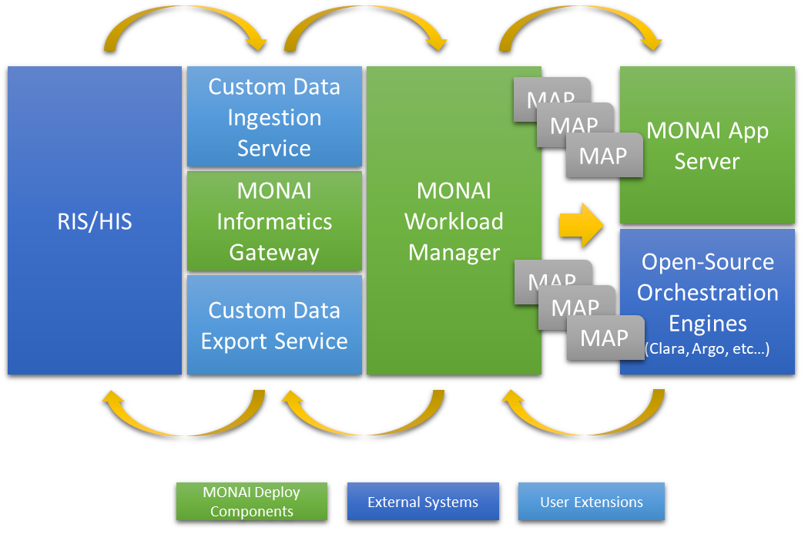

# MONAI Workload Manager Requirements

## Overview

The MONAI Workload Manager (MWM) is the central hub for the MONAI Deploy platform for routing data from/to the applications and healthcare information systems (HIS)/radiological information system (RIS).

MWM is responsible for routing data received by the data ingesting services to the data discovery agents and associate the data to matching application.  It is also responsible for monitoring application execution statuses and route any results produced by the applications back to HIS/RIS.

## Scope
The scope of this document is limited to the MONAI Workload Manager. There are other subsystems of the MONAI Deploy platform such as [MONAI Informatics Gateway](https://github.com/Project-MONAI/Informatics-Gateway), [MONAI App SDK](https://github.com/Project-MONAI/monai-app-sdk). However, this requirements document does not address specifications belonging to those subsystems.

## Goal
The goal for this proposal is to enlist, prioritize and provide clarity on the requirements for MONAI Workload Manager. Developers working on different software modules in MONAI Workload Manager SHALL use this specification as a guideline when designing and implementing software for the MONAI Workload Manager.

## Standard Language
This document SHALL follow the guidance of [rfc
2119](https://datatracker.ietf.org/doc/html/rfc2119) for terminology.

## Success Criteria
Data SHALL be routed to the user-defined applications and results, if any, SHALL be routed back to configured HIS.

## Attributes of a Requirement
For each requirement, the following attributes have been specified

**Requirement Body**: This is the text of the requirement which describes the goal and purpose behind the requirement.

**Background**: Provides necessary background to understand the context of the requirements.

**Verification Strategy**: A high level plan on how to test this requirement at a system level.

**Target Release**: Specifies which release of the MONAI App SDK this requirement is targeted for.

## Data Ingestion Requirements

### [REQ] MWM SHALL allow users to upload data

An API must be provided to the data ingestion services, such on the Informatics Gateway, to upload payloads to the data discovery engine.

#### Background
With the design of MONAI Deploy, the MWM does not interface with HIS/RIS directly but rather, through the Informatics Gateway (a data ingestion service).  Therefore, APIs must be provided to interface any data ingestion services.  This also allows the users of the platform to extend these APIs to interface their systems using different messaging protocols.

#### Verification Strategy
Verify that payloads can be uploaded from data ingestion services and dispatched to the data discovery engine.

#### Target Release
MONAI Workload Manager R1

### [REQ] MWM SHALL allow users to upload data and associate with one or more applications

An API shall be provided to allow data to be uploaded and routed to one or more designated applications directly without using the data discovery engine.

#### Background
In a scenario where the application to be executed is already known, the API would be able to skip the data routing agent.

#### Verification Strategy
Verify that payloads can be uploaded from a data ingestion service and then trigger one or more applications.

#### Target Release
MONAI Workload Manager R1

### [REQ] MWM SHALL be able to discover applications deployed on MONAI Deploy
MWM shall discover applications deployed on the systems and make them available to the data discovery agent and export sinks.

#### Background
In order to associate user-defined data discovery rules with applications, users and MWM, itself must know all MONAI applications deployed on the platform. This also allows users to link each deployed applications to one or more export sinks.

#### Verification Strategy
For a deployed application, it must be associable by the data routing agent and/or export sinks.

#### Target Release
MONAI Workload Manager R1

## Data Discover Agent/Rules Requirements

### [REQ] MWM Data Discover Agent (DDA) SHALL be able to filter data by DICOM header
MWM DDA shall allow users to define filtering rules based on DICOM headers using pre-built functions, such as, equals, contains, greater, greater-than, less, less-than, etc...

#### Background
Given that multiple applications may be deployed on the MONAI Deploy platform and often more jobs are scheduled and launched than available resources.  To avoid launching all applications and let the applications decide if a dataset is a fit, the DDA applies user defined DICOM header rules to select the dataset that meets its requirements before launching the application.

#### Verification Strategy
Given a set of data discovery rules using the pre-built functions and a DICOM dataset, the data discovery agent applies the rule to removes any data that is not suitable.

#### Target Release
MONAI Workload Manager R1

### [REQ] MWM Data Discover Agent (DDA) SHALL allow users to configure how long to wait for data before launching a job
MWM DDA shall allow users to define a time range to wait for all data to be ready before launch the associated application(s)

#### Background
Often time, data comes in through multiple connections and/or different sources.  E.g., a DICOM study may be sent over multiple associations.  This allows the DDA to wait for a period before it assembles the payload for the associated application(s).

#### Verification Strategy
Configure a rule set with a timeout and send data that meets the requirements of an application in separate connections within the timeout defined.

#### Target Release
MONAI Workload Manager R1

### [REQ] MWM Data Discover Agent (DDA) SHALL be able to filter data by FHIR data fields
MWM DDA shall allow users to define filtering rules based on FHIR data attributes using pre-built functions, such as, equals, contains, greater, greater-than, less, less-than, etc...

#### Background
Given that multiple applications may be deployed on the MONAI Deploy platform and often more jobs are scheduled and launched than available resources.  To avoid launching all applications and let the applications decide if a dataset is a fit, the DDA applies user defined FHIR filtering rules to select the dataset that meets applications' requirement before launching the application.

#### Verification Strategy
Given a set of data discovery rules using the pre-built functions and some FHIR resources, the data discovery agent applies the rule to removes any data that does not meeting the application's requirements.

#### Target Release
MONAI Workload Manager R2

### [REQ] MWM SHALL respect user-defined data discovery rules
Data discovery agent must apply all user-defined rules to the data arrived at the system.

#### Background
An application/model is often designed and restricted to a very specific type/format of data.  A data discovery rule is a pre-filter that validates a given dataset to see if the dataset meets the requirements of an/a application/model.

#### Verification Strategy
Given a data discovery rule set and a dataset, the data discovery agent applies the rules to removes any data that is not suitable.

#### Target Release
MONAI Workload Manager R1

### [REQ] MWM SHALL be able to route incoming data to one or more applications
A user-defined data discovery rule shall be associable with one or more deployed applications.

#### Background
A given set of user-defined data discovery rules can sometime meet the criteria of multiple applications/models.  This allows users to deploy the rules once and associate it with multiple applications/models.

#### Verification Strategy
Deploy a rule set and associate it with two applications.  Verify that both applications are launched when data is received and meets the requirements of the rule sets.

#### Target Release
MONAI Workload Manager R1

### [REQ] MWM SHALL allow application produced outputs routed back to another application
MWM shall allow output of an application to be routed back to other application(s).

#### Background
Given that DDA only filters data based on a static list of rules and cannot apply complex algorithms to a dataset, it may often not meet the needs of an application.  Therefore, this requirement enables user to construct a complex data filtering application to decide and output the dataset that is suitable for another application.

#### Verification Strategy
Deploy and link a data filtering application and a main application.  Verify that the main application receives output from the data filtering application.

#### Target Release
MONAI Workload Manager R2

## Data Export Requirements

### [REQ] MWM SHALL support multiple export sinks (destinations)
An export sink is an association of an application and a data export service that allows results generated by the application to be exported to designated destination.

#### Background
AI applications and medical imaging algorithms often output data in different formats that need to be exported back to HIS/RIS for reading or validation.  The concept of a sink links a deployed application to an export service so the output data can be exported back to RIS/HIS applications.

#### Verification Strategy
Verify that applications can be linked to a sink.

#### Target Release
MONAI Workload Manager R1

### [REQ] MWM SHALL be able to route data to multiple sinks
MWM shall allow multiple sinks to be linked to an application so output data can be exported to multiple destinations.

#### Background
There are a few common data protocols in the healthcare industry such as, DICOM, HL7 and FHIR and often each protocol requires a dedicated client to communicate with it. Given that applications may often produce outputs in different formats, each format, again, DICOM, HL7 and/or FHIR, must be handled by a dedicated client.  This requirement would enable users to link one application to multiple sinks.

#### Verification Strategy
Link a deployed application to multiple sinks.

#### Target Release
MONAI Workload Manager R1

### [REQ] MWM SHALL allow users to create custom sinks
In order to support custom export services, MWM shall allow custom sinks to be created.

#### Background
Besides industry standard protocols such as, DICOM, there may be other proprietary method of transmitting data.  This would allow users to enable their services to pick up any results produced by their applications.

#### Verification Strategy
Create an application to simulate an export service by implementing available APIs.

#### Target Release
MONAI Workload Manager R1

## Functional Requirements

### [REQ] MWM SHALL be able to support multiple orchestration engines
Besides integrating MONAI App Server, MWM shall support other popular OSS orchestration engines so MONAI App SDK can be easily integrated.

#### Background
Many existing users have already invested in other orchestration engines which may have already become a requirement for their workflow.  Therefore, supporting other OSS orchestration engines would simplify the integration of their existing environment with MONAI products.

#### Verification Strategy
Verify by repeating the same workflow and same application on both MONAI App Server and another OSS orchestration engine, such as, Argo.

#### Target Release
MONAI Workload Manager R2

### [REQ] MWM SHALL track status/states of all jobs initiated with orchestration engines
MWM shall track status/states of all the jobs that it has initiated so it can be used for reporting and allows other sub-components to react upon.

#### Background
Often OSS orchestration engines provide its own set of tools/CLI to query and check status of its jobs.  Given that MWM supports multiple orchestration engines and contains many sub-systems and/or sub-components need to react upon the status or state of a job, it is ideal that a single sub-system keep track of all job states/status and make them available to other sub-systems/sub-components.

#### Verification Strategy
Set up MWM with two orchestration engines, trigger a couple jobs and make sure statues and states are stored in MWM.

#### Target Release
MONAI Workload Manager R1

### [REQ] MWM SHALL allow users to define storage cleanup rules
MWM shall provide functionalities on how and when payloads can be removed from the system.

#### Background
Often medical records, especially medical images, requires large amount of disk storage and given that disk storage space is always limited, there must exist a method to remove payloads. For MWM, payloads that are associated with a job that completes in a successful state may be removed while ones that failed may need to be kept for further investigation.

#### Verification Strategy
Verify that payloads are removed based on users' configuration.

#### Target Release
MONAI Workload Manager R2

