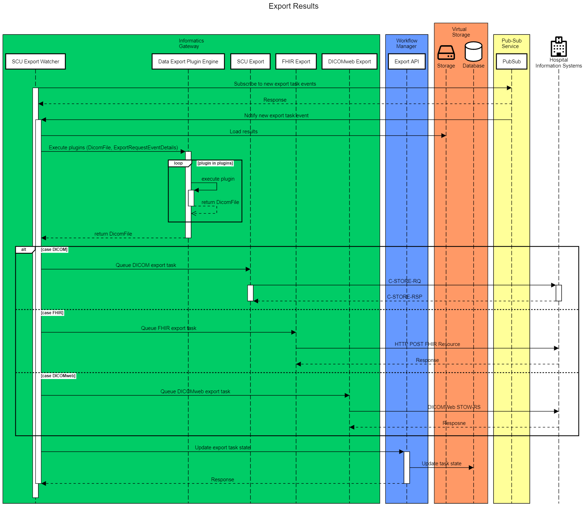

# MONAI Deploy Informatics Gateway Software Architecture & Design

## Overview

The MONAI Deploy Informatics Gateway (MIG) integrates hospital information systems (HIS) and the MONAI Deploy platform. Its goal is to enable interoperability between DICOM devices, EHR systems with the MONAI Deploy platform by using commonly used standards in the healthcare industry.

### Purpose

This document describes the detailed designs derived from the requirements defined in [MONAI Deploy Informatics Gateway Requirements](informatics-gateway-requirements.md).

### Scope

The scope of this document is limited to the design of MONAI Deploy Informatics Gateway. Therefore, this design document does not address any design decisions belonging to other subsystems, such as MONAI Workflow Manager, MONAI Deploy Application SDK.

### Assumptions, Constraints, Dependencies

1. No data validation is done on the received or retrieved dataset, including but not limited to DICOM and FHIR. Therefore the data processing consumer/user shall validate incoming data as part of the workflow.
1. MONAI Deploy Informatics Gateway is not intended for long-term DICOM storage and does not support Storage Commitment Requests. See implementation details for each of the bundled job processors.

### Definitions, Acronyms, Abbreviations

| Term            | Definition                                                                                                                                                                                                                |
| --------------- | ------------------------------------------------------------------------------------------------------------------------------------------------------------------------------------------------------------------------- |
| MIG             | MONAI Deploy Informatics Gateway                                                                                                                                                                                          |
| MWM             | MONAI Workflow Manager - A subsystem of the MONAI Deploy platform responsible for routing incoming data to one or more deployed applications and export any results produced by the applications to external HIS devices. |
| AE              | [Application Entity](http://dicom.nema.org/medical/dicom/current/output/chtml/part02/sect_A.3.4.html)                                                                                                                     |
| AE Title        | [Application Entity Title](http://dicom.nema.org/medical/dicom/current/output/chtml/part02/sect_A.3.4.html) (AET)                                                                                                         |
| DICOM           | [Digital Imaging and Communications in Medicine](https://www.dicomstandard.org/)                                                                                                                                          |
| DICOM Tag       | or simply ["Tag"](http://dicom.nema.org/medical/dicom/current/output/chtml/part02/sect_A.3.4.html)                                                                                                                        |
| FHIR            | [Fast Healthcare Interoperability Resources](https://en.wikipedia.org/wiki/Fast_Healthcare_Interoperability_Resources)                                                                                                    |
| HIS             | [Hospital information systems](https://en.wikipedia.org/wiki/Hospital_information_system)                                                                                                                                 |
| IOD             | [Information Object Definition](http://dicom.nema.org/medical/dicom/current/output/chtml/part02/sect_A.3.4.html)                                                                                                          |
| PACS            | [Picture Archiving and Communications System](https://en.wikipedia.org/wiki/Picture_archiving_and_communication_system)                                                                                                   |
| SCP             | [Service Class Provider](http://dicom.nema.org/medical/dicom/current/output/chtml/part02/sect_A.3.4.html)                                                                                                                 |
| SCU             | [Service Class User](http://dicom.nema.org/medical/dicom/current/output/chtml/part02/sect_A.3.4.html)                                                                                                                     |
| Transfer Syntax | [Transfer Syntax](http://dicom.nema.org/medical/dicom/current/output/chtml/part02/sect_A.3.4.html)                                                                                                                        |
| UID             | [Unique Identifier](http://dicom.nema.org/medical/dicom/current/output/chtml/part02/sect_A.3.4.html)                                                                                                                      |
| VR              | [Value Representation](http://dicom.nema.org/medical/dicom/current/output/chtml/part02/sect_A.3.4.html)                                                                                                                   |

### Reference Documents

- [Informatics Gateway Requirements](informatics-gateway-requirements.md)

---

## ​Architecture Details

The goal is to provide an easy integration path with hospital information systems and integrate image processing/inference workflows using MIG.

The design of MONAI Deploy Informatics Gateway is to follow the communication and data standards in the healthcare industry to enable interoperability between HIS and the MONAI Deploy platform. Such standards, including, but not limited to, DICOM, DICOMweb, and FHIR.

### API Surface Area

MIG provides the following services for interacting with external devices and services.

#### DICOM

- **DICOM SCP** to listen for incoming verification and store requests.
- **DICOM SCU** to export DICOM dataset to designated DICOM devices.

#### DICOM web

- **DICOMweb Client** to query, retrieve, store DICOM dataset against configured DICOMweb servers.

#### FHIR

- **FHIR Client** to interact with an FHIR server and its available FHIR resources.

#### Others

- **ACR-DSI API** provides a standard for AI model inference in a clinical workflow.
- **Management APIs** provide functionalities of configuring MIG during runtime.

---

## Design

### DICOM SCP Service

MIG's (the system) Storage SCP provides DICOM C-ECHO (REQ-DCM-01) and C-STORE (REQ-DCM-02]) services to interface with other DICOM devices, such as PACS. The system allows users to configure the listening port (REQ-DCM-07). In addition, the system enables users to configure one or more AE Titles (REQ-DCM-06) where each AET allows one or more concurrent (REQ-DCM-12) incoming associations at a given time. MIG rejects incoming associations if more than configured associations are in session.

(REQ-FNC-04) Users may configure each AE Title to group instances received by patient, study, or series. MIG publishes a "Workflow Request" event per group.  For example, when the AE Title is configured to group instances by DICOM Study and a DICOM dataset is received with five different Study Instance UIDs, five "Workflow Request" events are published.

(REQ-FNC-03) Each AE Title can have a timeout value configured that specifies how long MIG shall wait before notifying other subsystems of data arrival.  MIG triggers a "Workflow Request" event only after the amount of time has passed since the last received instance.

MIG generates a unique identifier (UUID) for data flow correlation and troubleshooting purposes upon accepting an incoming association. In addition, MIG includes the UUID when triggering a "Workflow Request" event.

(REQ-DCM-13) If enabled, the AET verifies the calling AET by validating the source IP address and the calling AE Title against allowed sources (REQ-DCM-10).

(REQ-FNC-02]) Upon timeout waiting for data, MIG notifies other subsystems that the data is available for processing.

(REQ-DCM-08) The C-ECHO (verification) service can be enabled or disabled based on configuration.

#### Association Policies

- MIG SCP AET accepts associations but does not initiate associations.
- MIG Storage SCP, by default, accepts up `25` (configurable) concurrent associations.
- MIG Storage SCP accepts associations when storage space usage is less than the configured watermark and the available storage space is above the configured reserved storage size.
- Asynchronous mode is not supported. All operations are performed synchronously.
- The Implementation Class UID is `1.3.6.1.4.1.30071.8` and the Implementation Version Name is `fo-dicom {major}.{minor}.{build}`.

#### Security Profiles

MIG Storage SCP does not conform to any defined DICOM Security Profiles.
The product is assumed to be used within a secured environment that uses a Firewall, Router Protection, VPN, and other security measures.

MIG Storage SCP service can be configured to accept all incoming association requests or check against an allow listed AET and its:

- Called AE Title
- Calling AE Title
- Calling IP Address

#### Retry Logic

(REQ-FNC-01) The system would retry the following actions upon failure. 

| Action       | Retry Delay             | Maximum Retries |
| ------------ | ----------------------- | --------------- |
| Save to disk | Sliding: 250ms - 1000ms | 3               |
| Notify MWM   | Sliding: 250ms - 1000ms | 3               |

---

### DICOM SCU Service

MIG's (the system) Storage SCU provides DICOM C-STORE service to interface with other medical devices, such as PACS, to enable exporting (REQ-DCM-03) of any DICOM artifacts produced by the applications.

(REQ-DCM-09) The users can configure the SCU AE Title in the configuration file.

MIG DICOM Storage SCU initiates a push of DICOM objects or a C-STORE request to the Remote DICOM Storage SCP. The system shall allow multiple Remote (destination) SCPs to be configured (REQ-DCM-11).

Each Remote DICOM Storage SCP must be uniquely named so the MONAI Workflow Manager can reference them.

C-STORE SCU stops all processing when storage space usage is less than the configured watermark and the available storage space is above the configured reserved storage size.

#### SOP Classes (Transfer) Supported & Transfer Syntax

The DICOM Store SCU service shall support all SOP Classes of the Storage Service Class.

The DICOM Store SCU service shall transfer a DICOM object as-is using stored Transfer Syntax without the support of compression, decompression, or Transfer Syntax conversion.

#### Association Policies

- MIG DICOM Storage SCU initiates associations but does not accept associations.
- MIG DICOM Storage SCU allows, by default, 2 (configurable) SCU instances simultaneously.
- Asynchronous mode is not supported. All operations are performed synchronously.
- The Implementation Class UID is `1.3.6.1.4.1.30071.8` and the Implementation Version Name is `fo-dicom {major}.{minor}.{build}`.

#### Security Profiles

Not applicable.

#### Retry Logic

(REQ-FNC-01) The system would retry the following actions upon failure. 

| Action | Retry Delay             | Maximum Retries |
| ------ | ----------------------- | --------------- |
| Export | Sliding: 250ms - 1000ms | 3               |

---

### DICOMweb Client

The DICOMweb client enables querying, retrieving, and storing of DICOM objects to DICOMweb enabled services.

#### WADO Client APIs

(REQ-DCW-02) WADO (Web Access to DICOM Objects) client contains a set of APIs defined by the DICOM standard. MIG supports the following WADO APIs:

- `GET /studies/{study}` Retrieve Study
- `GET /studies/{study}/metadata` Retrieve Study metadata
- `GET /studies/{study}/series/{series}` Retrieve Series
- `GET /studies/{study}/series/{series}/metadata` Retrieve Series metadata
- `GET /studies/{study}/series/{series}/instances/{instance}` Retrieve Instance
- `GET /studies/{study}/series/{series}/instances/{instance}/metadata` Retrieve Instance metadata
- `GET /studies/{study}/series/{series}/instances/{instance}/bulkdata/{bulkdata}` Retrieve Bulkdata

#### QIDO Client APIs

(REQ-DCW-01) QIDO (Query based on ID for DICOM Objects) client contains a set of APIs defined by the DICOM standard, and MIG supports the following QIDO APIs:

- `GET /studies` Search for Studies

#### STOW Client APIs

(REQ-DCW-03) STOW (Store Over the WEb) client enables storing DICOM instances to a DICOMweb server.
MIG supports the following STOW APIs:

- `POST /studies` Store instances
- `POST /studies/{study}` Store instances

#### Retry Logic

(REQ-FNC-01) The DICOMweb client does not perform any retries. However, the Data Retrieval component that utilizes the DICOMweb client would handle retries.

| Action | Retry Delay | Maximum Retries |
| ------ | ----------- | --------------- |
| \*     | None        | None            |

---

### FHIR Client

(REQ-EHR-01) MIG (the system) provides an FHIR client to exchange FHIR resources with FHIR enabled services.

To retrieve an FHIR resource, users must specify the type and ID of a resource.
The system retrieves FHIR resources, by default, in JSON format. However, users may configure the request to retrieve the data in XML format.

MIG also allows users to export FHIR resources to designated FHIR services.

_Limitations_: The FHIR client works in conjunction with ACR API. To retrieve or export any FHIR resources, users must explicitly specify the endpoints of each FHIR service.

#### Retry Logic

The FHIR client does not perform any retries. However, the Data Retrieval component that utilizes the FHIR client would handle retries.

| Action | Retry Delay | Maximum Retries |
| ------ | ----------- | --------------- |
| \*     | None        | None            |

---

### Logging

MONAI Deploy Informatics Gateway logs all its actions and associates each activity with the unique identifier for traceability.

(REQ-LOG-03) MIG utilizes Microsoft Logging Extension to enable logging of all its activities and defaults to the logging levels defined in the [LogLevel Enum](https://docs.microsoft.com/en-us/dotnet/api/microsoft.extensions.logging.loglevel).

(REQ-LOG-01) Users may enable logging DIMSE datasets in the config file for SCP and SCU.  However, anonymization is not available for DIMSE datasets.

---

### ACR-DSI API (future)

The American College of Radiology's Data Science Institute proposed the [ACR-DSI API](https://www.acrdsi.org/-/media/DSI/Files/ACR-DSI-Model-API.pdf) for medical imaging inference.  Please note that the implementation may differ from the original proposal but is fully compatible with the official specs. Please refer to the API documentation for details.

MIG schedules and retrieves all data specified in the request body upon receiving the inference request. When all the described datasets are retrieved, MIG sends a "Workflow Request" event (REQ-FNC-02)  to notify other subsystems that data is ready and is available for processing.  If any failures occur while retrieving data, the service schedules one or more retries (REQ-FNC-01) based on user configuration.

The transaction ID supplied in the API call is used when notifying MWM of the dataset for data flow trace purposes. Therefore, **the transaction ID must be unique**.

The following APIs are supported to interact with the ACR-DSI API:

#### Retry Logic

(REQ-FNC-01) The Data Retrieval Service performs retries upon any failure while retrieving data via DICOMweb and FHIR.

| Action | Retry Delay | Maximum Retries |
| ------ | ----------- | --------------- |
| \*     | 1000        | 3               |

#### Inference API

[Inference API](../docs/api/rest/inference.md)

---

### Health API

[Health API](../docs/api/rest/health.md)

---

### Config API

[Config API](../docs/api/rest/config.md)

---

### Storage & Subsystems

#### Data Storage

MIG stores all received & retrieved medical records first in the temporary storage before the dataset is assembled (grouped) by the `Payload Assembler` based on the AE Title's configuration.  Once data is assembled into a `Payload` object, MIG uploads all the files to the virtual storage device specified in the configuration file.

MIG ships with [MinIO](https://min.io/) as the default storage service provider given that it supports local, on-prem and cloud storage solutions.  However, the default storage service can be easily replaced by implementing the [Monai.Deploy.InformaticsGateway.Api.Storage.IStorageService](https://github.com/Project-MONAI/monai-deploy-informatics-gateway/blob/main/src/Api/Storage/IStorageService.cs) interface. This enables users to extend MIG to meet their needs.

#### Retry Logic

(REQ-FNC-01) Data uploading to the shared storage includes built-in retry logic with the following defaults:

| Action | Retry Delay    | Maximum Retries |
| ------ | -------------- | --------------- |
| Upload | 250, 500, 1000 | 3               |

#### Subsystem Communication

Informatics Gateway and the Workflow Manager follow the publisher-subscriber pattern for message exchanges. Accordingly, Informatics Gateway publishes and subscribes to the following events:

##### Message Broker

MIG publishes and subscribes to events to/from other subsystems using the `IMessageBrokerPublisherService` interface and `IMessageBrokerSubscriberService` interface, respectively. The default message broker service used is provided by [RabbitMQ](https://www.rabbitmq.com/).

Message bodies are serialized to JSON before sending to the configured service.

##### Published Events

- Workflow Request event
  - Queue name: `md.workflow.request`
  - Class name: `WorkflowRequestMessage`
  
  | Property      | Type          | Description                                                                                                                                                                                     |
  | ------------- | ------------- | ----------------------------------------------------------------------------------------------------------------------------------------------------------------------------------------------- |
  | Bucket        | string        | Name of the bucket/directory name, which can be used to locate the payload on the shared storage.                                                                                               |
  | PayloadId     | string (UUID) | A UUID generated by Informatics Gateway for internal use.                                                                                                                                       |
  | Workflows     | string[]      | Workflows associated with the payload, if any.                                                                                                                                                  |
  | FileCount     | int           | Number of files in the payload.                                                                                                                                                                 |
  | CorrelationId | string        | For DIMSE, the correlation ID is the UUID associated with the first DICOM association received. For an ACR inference request, the correlation ID is the Transaction ID in the original request. |

- Export Complete event
  - Queue name: `md.export.complete`
  - Class name: `ExportCompleteMessage`
  
   | Property     | Type          | Description                                                   |
   | ------------ | ------------- | ------------------------------------------------------------- |
   | WorkflowId   | string (UUID) | A UUID generated by the Workflow Manager.                     |
   | ExportTaskId | string (UUID) | A UUID generated by the Workflow Manager for the export task. |
   | Status       | string (enum) | Success, Failure                                              |
   | Message      | string        | Optional for error messages.                                  |

##### Subscribed Events

- Export task event
  - Queue name: `md.export.request`
  - Class name: `ExportRequestMessage`
  
    | Property      | Type          | Description                                                                                                                                                                   |
    | ------------- | ------------- | ----------------------------------------------------------------------------------------------------------------------------------------------------------------------------- |
    | WorkflowId    | string (UUID) | A UUID generated by the Workflow Manager.                                                                                                                                     |
    | ExportTaskId  | string (UUID) | A UUID generated by the Workflow Manager for the export task.                                                                                                                 |
    | Files         | string[]      | A list of files to be exported.                                                                                                                                               |
    | Target        | string        | Export target. For DICOM C-STORE, a named DICOM destination.  For ACR request, use the Transaction ID in the original request.                                                |
    | CorrelationId | string        | For DIMSE, the correlation ID is the UUID associated with the first DICOM association received. For an ACR inference request, use the Transaction ID in the original request. |