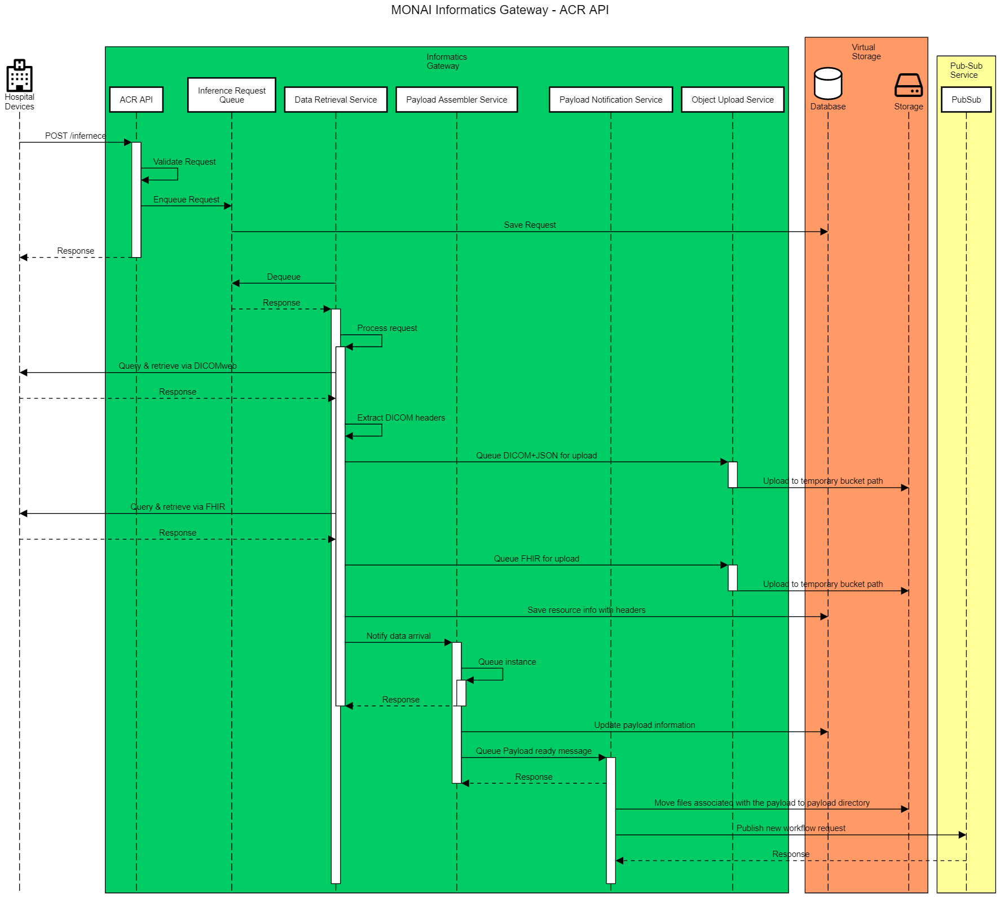

# MONAI Deploy Informatics Gateway Software Architecture & Design

## Overview

The MONAI Deploy Informatics Gateway (MIG) integrates hospital information systems (HIS) and the MONAI Deploy platform. It enables interoperability between HIS and the MONAI Deploy platform by using commonly used standards in the healthcare industry.

### Purpose

This document describes the detailed designs derived from the requirements defined in [MONAI Deploy Informatics Gateway Requirements](informatics-gateway-requirements.md).

### Scope

The scope of this document is limited to the design of MONAI Deploy Informatics Gateway. Therefore, this design document does not address any design decisions belonging to other subsystems, such as MONAI App Server, MONAI Deploy Application SDK.

### Assumptions, Constraints, Dependencies

1. No data validation is done on the received or retrieved dataset, including but not limited to DICOM and FHIR. However, the data processing consumer/user shall validate incoming data as part of the workflow.
1. MONAI Deploy Informatics Gateway is not intended for long-term DICOM storage and does not support Storage Commitment Requests. See implementation details for each of the bundled job processors.

### Definitions, Acronyms, Abbreviations

| Term            | Definition                                                                                                                                                                                      |
| --------------- | ----------------------------------------------------------------------------------------------------------------------------------------------------------------------------------------------- |
| MIG             | MONAI Deploy Informatics Gateway                                                                                                                                                                       |
| MWM             | MONAI Workflow Manager - A subsystem of the MONAI Deploy platform responsible for routing incoming data to one or more deployed applications and export any results produced by the applications to external HIS devices. |
| AE              | [Application Entity](http://dicom.nema.org/medical/dicom/current/output/chtml/part02/sect_A.3.4.html)                                                                                           |
| AE Title        | [Application Entity Title](http://dicom.nema.org/medical/dicom/current/output/chtml/part02/sect_A.3.4.html) (AET)                                                                               |
| DICOM           | [Digital Imaging and Communications in Medicine](https://www.dicomstandard.org/)                                                                                                                |
| DICOM Tag       | or simply ["Tag"](http://dicom.nema.org/medical/dicom/current/output/chtml/part02/sect_A.3.4.html)                                                                                              |
| FHIR            | [Fast Healthcare Interoperability Resources](https://en.wikipedia.org/wiki/Fast_Healthcare_Interoperability_Resources)                                                                          |
| HIS             | [Hospital information systems](https://en.wikipedia.org/wiki/Hospital_information_system)                                                                                                       |
| IOD             | [Information Object Definition](http://dicom.nema.org/medical/dicom/current/output/chtml/part02/sect_A.3.4.html)                                                                                |
| PACS            | [Picture Archiving and Communications System](https://en.wikipedia.org/wiki/Picture_archiving_and_communication_system)                                                                         |
| SCP             | [Service Class Provider](http://dicom.nema.org/medical/dicom/current/output/chtml/part02/sect_A.3.4.html)                                                                                       |
| SCU             | [Service Class User](http://dicom.nema.org/medical/dicom/current/output/chtml/part02/sect_A.3.4.html)                                                                                           |
| Transfer Syntax | [Transfer Syntax](http://dicom.nema.org/medical/dicom/current/output/chtml/part02/sect_A.3.4.html)                                                                                              |
| UID             | [Unique Identifier](http://dicom.nema.org/medical/dicom/current/output/chtml/part02/sect_A.3.4.html)                                                                                            |
| VR              | [Value Representation](http://dicom.nema.org/medical/dicom/current/output/chtml/part02/sect_A.3.4.html)                                                                                         |

### Reference Documents

- [Informatics Gateway Requirements](informatics-gateway-requirements.md)

---

## ​Architecture Details

The goal is to provide an easy integration path with hospital information systems and integrate image processing/inference workflows using MIG.

MONAI Deploy Informatics Gateway is designed to follow communication and data standards in the healthcare industry to enable interoperability between HIS and the MONAI Deploy platform. Such standards are, but not limited to, DICOM, DICOMweb, and FHIR.

### API Surface Area
MIG provides the following services for interacting with external devices and services.

#### DICOM

- **DICOM SCP** to listen for incoming verification and store requests.
- **DICOM SCU** to export DICOM dataset to designated DICOM devices.

#### DICOM web

- **DICOMweb Client** to query, retrieve, store DICOM dataset against configured DICOMweb servers.

#### FHIR

- **FHIR Client** to interact with an FHIR server and its available FHIR resources.

#### Others

- **ACR-DSI API** to provide a standard for AI model inference in a clinical workflow.
- **Management APIs** to provide functionalities of configuring MIG during runtime.

---

## Design

### DICOM SCP Service

MIG's (the system) Storage SCP provides DICOM C-ECHO and C-STORE services to interface with other DICOM devices, such as PACS. In addition, the system allows users to configure one or more AE Titles where each AET allows one or more concurrent incoming associations at a given time. Associations are rejected if more than configured associations are in session.

A unique identifier (UUID) is generated for data flow correlation purposes upon accepting an incoming association. This UUID is also used when uploading to the MWM.

If enabled, the AET verifies the calling AET by validating the source IP address and the calling AE Title against allowed sources.

If enabled, the AET verifies the calling AET by validating the source IP address and the calling AE Title against allowed sources.

The C-ECHO (verification) service can be enabled or disabled based on configuration.

#### Association Policies

- MIG SCP AET accepts associations but does not initiate associations.
- MIG Storage SCP, by default, accepts up `25` (configurable) concurrent associations.
- MIG Storage SCP accepts associations when storage space usage is less than the configured watermark, and the available storage space is above the configured reserved storage size.
- Asynchronous mode is not supported. All operations are performed synchronously.
- The Implementation Class UID is `1.3.6.1.4.1.30071.8` and the Implementation Version Name is `fo-dicom {major}.{minor}.{build}`.

#### Security Profiles

MIG Storage SCP does not conform to any defined DICOM Security Profiles.
The product is assumed to be used within a secured environment that uses a Firewall, Router Protection, VPN, etc.

MIG Storage SCP service can be configured to accept all incoming association requests or check against an allowed AET and its:

- Called AE Title
- Calling AE Title
- Calling IP Address

#### Retry Logic

The system would retry the following actions upon failure. Values can be overridden in the configuration file.

| Action       | Retry Delay             | Maximum Retries |
| ------------ | ----------------------- | --------------- |
| Save to disk | Sliding: 250ms - 1000ms | 3               |
| Notify MWM   | Sliding: 250ms - 1000ms | 3               |

---

### DICOM SCU Service

MIG's (the system) Storage SCU provides DICOM Storage Service to interface with other medical devices, such as PACS, to export any DICOM artifacts produced by the applications.

The users can configure the SCU AE Title in the configuration file.

MIG DICOM Storage SCU initiates a push of DICOM objects or a C-STORE request to the Remote DICOM Storage SCP. The system shall allow multiple Remote (destination) SCPs to be configured.

Each Remote DICOM Storage SCP must be uniquely named so MWM sinks can reference them.

C-STORE SCU stops all processing when storage space usage is less than the configured watermark, and the available storage space is above the configured reserved storage size.

#### SOP Classes (Transfer) Supported & Transfer Syntax

The DICOM Store SCU service shall support all SOP Classes of the Storage Service Class.

The DICOM Store SCU service shall transfer a DICOM object using stored Transfer Syntax without the support of compression, decompression, or Transfer Syntax conversion.

#### Association Policies

- MIG DICOM Storage SCU initiates associations but does not accept associations.
- MIG DICOM Storage SCU allows, by default, 2 (configurable) SCU instances simultaneously.
- Asynchronous mode is not supported. Instead, all operations are performed synchronously.
- The Implementation Class UID is `1.3.6.1.4.1.30071.8` and the Implementation Version Name is `fo-dicom {major}.{minor}.{build}`.

#### Security Profiles

Not applicable.

#### Retry Logic

The system would retry the following actions upon failure. Values can be overridden in the configuration file.

| Action | Retry Delay             | Maximum Retries |
| ------ | ----------------------- | --------------- |
| Export | Sliding: 250ms - 1000ms | 3               |

---

### DICOMweb Client

The DICOMweb client enables querying, retrieving, and storing of DICOM objects to DICOMweb enabled services.

#### WADO Client APIs

WADO (Web Access to DICOM Objects) client contains a set of APIs defined by the DICOM standard. MIG supports the following WADO APIs:

- `GET /studies/{study}` Retrieve Study
- `GET /studies/{study}/metadata` Retrieve Study metadata
- `GET /studies/{study}/series/{series}` Retrieve Series
- `GET /studies/{study}/series/{series}/metadata` Retrieve Series metadata
- `GET /studies/{study}/series/{series}/instances/{instance}` Retrieve Instance
- `GET /studies/{study}/series/{series}/instances/{instance}/metadata` Retrieve Instance metadata
- `GET /studies/{study}/series/{series}/instances/{instance}/bulkdata/{bulkdata}` Retrieve Bulkdata

#### QIDO Client APIs

QIDO (Query based on ID for DICOM Objects) client contains a set of APIs defined by the DICOM standard, and MIG supports the following QIDO APIs:

- `GET /studies` Search for Studies

#### STOW Client APIs

STOW (Store Over the WEb) client enables storing DICOM instances to a DICOMweb server.
MIG supports the following STOW APIs:

- `POST /studies` Store instances
- `POST /studies/{study}` Store instances

#### Retry Logic

The DICOMweb client does not perform any retries. However, the Data Retrieval component that utilizes the DICOMweb client would handle retries.

| Action | Retry Delay | Maximum Retries |
| ------ | ----------- | --------------- |
| \*     | None        | None            |

---

### FHIR Client

MIG (the system) provides an FHIR client to exchange FHIR resources with FHIR enabled services.

To retrieve an FHIR resource, users must specify the type and ID of a resource.
The system retrieves FHIR resources, by default, in JSON format. However, the user may modify the request body to instruct Informatics Gateway to retrieve FHIR resources in XML format.

MIG also allows users to export FHIR resources to designated FHIR services.

_Limitations_: The FHIR client works in conjunction with ACR API. To retrieve or export any FHIR resources, users must explicitly specify the endpoints of each FHIR service.

#### Retry Logic

The FHIR client does not perform any retries. However, the Data Retrieval component that utilizes the FHIR client would handle retries.

| Action | Retry Delay | Maximum Retries |
| ------ | ----------- | --------------- |
| \*     | None        | None            |

---

### Logging

MONAI Deploy Informatics Gateway logs all its actions and associates each activity with a unique identifier for traceability.

Different log levels are used and are defined in [LogLevel Enum](https://docs.microsoft.com/en-us/dotnet/api/microsoft.extensions.logging.loglevel).

The entire DIMSE dataset (for SCP) may be logged, but no anonymization would be performed, and therefore this feature is, by default, disabled.

---

### ACR-DSI API (future)

The [ACR-DSI API](https://www.acrdsi.org/-/media/DSI/Files/ACR-DSI-Model-API.pdf) is proposed by the American College of Radiology's Data Science Institute.  The implementation of the API specs may be different from the original proposal. Please refer to the API documentation for details.

The transaction ID supplied in the API call is used when notifying MWM of the dataset for data flow trace purposes. Therefore, the transaction ID must be unique.

The following APIs are supported to interact with the ACR-DSI API:

#### Inference API

Please refer to [User Guide](../docs/api/rest/inference.md) for complete API reference.

---

### Health API

Please refer to [User Guide](../docs/api/rest/health.md) for complete API reference.

---

### Configuration API

Please refer to [User Guide](../docs/api/rest/config.md) for complete API reference.
